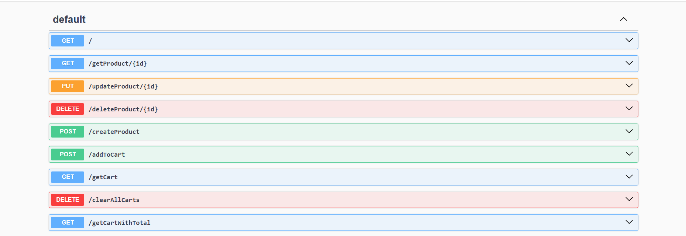

# Book Store Web Application

A web application for managing a book store. The application allows users to browse books, add them to their cart, and proceed with checkout. Admins can manage books (CRUD operations) via an easy-to-use interface. The cart system supports adding multiple books, viewing the cart, and calculating the total with potential discounts.

**Live Demo:** https://bookstorefiat.netlify.app/ 

## Features

### For Users:
- **Browse Books**: View a paginated list of books with details like name, price, and description.
- **Add to Cart**: Add books to the cart and view the cart content.
- **Cart Management**: View total price with discounts applied, and update quantities in the cart.

### For Admins:
- **Create, Read, Update, Delete (CRUD) Books**: Manage books in the inventory, including the ability to upload book images.
- **View and Manage Carts**: Admins can view the cart data and the total price calculation for all users.

## Technologies Used
- **Backend**: Node.js, Express
- **Database**: MongoDB (with Mongoose)
- **File Storage**: Multer for handling file uploads (book images)
- **API Documentation**: Swagger for automatic API documentation and testing
- **Frontend**: Using React and Tailwind CSS .

